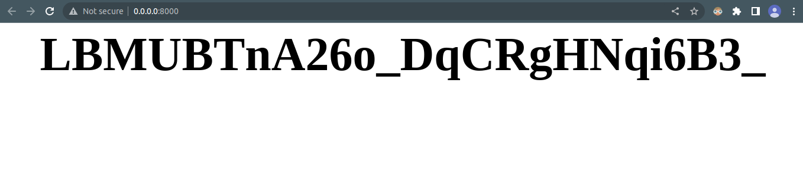

# Foobar

simple server to test nodejs apps

demo result app


## Installation

Use the package manager [npm]() to install this.

```bash
git clone https://github.com/yopaaa/nanoid-server.git
```

## Usage

```bash
# you can change port in .env
# default port is 8000

# install node modules
npm install

# run the server
npm run start

```

## Contributing

Pull requests are welcome. For major changes, please open an issue first
to discuss what you would like to change.

Please make sure to update tests as appropriate.

## License

[MIT](https://choosealicense.com/licenses/mit/)